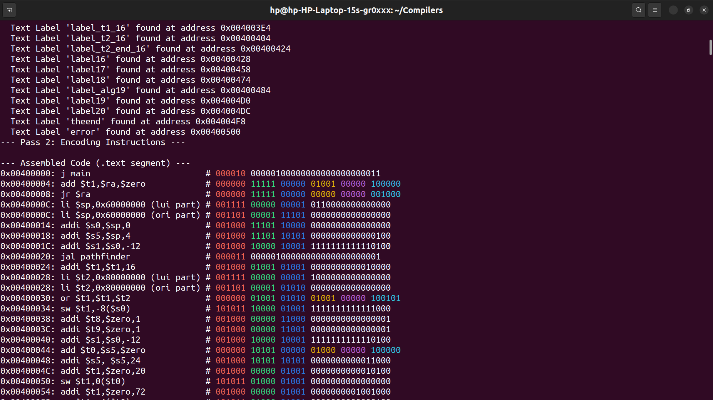

<h1>

<label><i>Alg</i></label>oLang</label>
</h1>

AlgoLang is a custom programming language featuring both a tree-walk interpreter and a compiler targeting a custom MIPS32-based architecture with Floating Point Unit (FPU) and basic Quantum Computing (QC) extensions.

## Language Features

AlgoLang supports a variety of programming paradigms and features:

*   **Typing**: Dynamically typed when interpreted, with runtime type checking. Statically (lexically) scoped when compiled.
*   **Operators**: Standard arithmetic (`+`, `-`, `*`, `/`, `//` or `div`, `%` or `mod`, `^`), logical (`and`, `or`, `not`), and comparison (`<`, `>`, `==`, `<=`, `>=`) operators.
*   **Data Structures**:
    *   **Lists**: Dynamically sized lists when run with interpreter and fixed size when compiled, except with concatenation available. Can be created empty with `list <size>;` or initialized like `(1, 2, 3)`. Lists are concatenated with `+`.
    *   **Vectors**: Similar to NumPy arrays when interpreted, treated as lists when compiled. Created with `vec size;`, `vec (1, 2, 3)`, or `vec <shape_tuple>` where `<shape_tuple>` is another vector. Supports element-wise operations.
    *   **Dictionaries**: Hash tables initialized using `dict var;` or `dict list[index];` Not available when compiled, yet.
*   **Control Flow**:
    *   `if`/`elif`/`else` conditional statements.
    *   `while` loops.
    *   Loop control: `breakloop` (breaks loop) and `skipit` (continues to next iteration).
    *   `else` can be used after `while` to execute if the `while` was not broken, just like in Python.
*   **Functions**:
    *   First-class functions defined using the `alg` keyword: `myFunc = alg(arg1, arg2) { ... return result; };`.
    *   Functions can be values, passed around, and returned.
    *   Closures are supported both when interpreted and compiled, except with different behaviours of closed up-values.
*   **Variables**: Declared and optionally initialized using `let var = value;` or `let var;`. Assignment uses `=`.
*   **Getting Output**: Basic printing using the `print` statement.
*   **Extensibility**: Interpreter functionality can be extended via user-defined `SysCall`s. Built-in syscalls include `len`, `int`, `float`, `int2str`,`input`,`str`, `split`, `push`, `pop`, `keys`, `read`, `write`, `drawQC`, `import`, the first 5 of which run when compiled. Others are yet to be added to the compiler.
*   **Quantum Computing (Experimental)**:
    *   Interpreter uses Qiskit for simulation (`QG`, `measure`, `clearQ`, `drawQC`).
    *   Compiler targets custom "co-processor 2" instructions for basic Quantum Computing operations (`QG`,`measure`,`clearQ`).
*   **Plotting**: Basic terminal plotting via `termplotlib` using the `plot` statement when interpreted. Can be useful when running in shell environment.
*   **AST Visualization**: Abstract Syntax Tree can be visualized using `graphviz`.

## Toolchain

The AlgoLang project includes several components:

1.  **Interpreter (`SYNTAX.py`,`RUN.py`, `SHELL.py`)**:
    *   Executes AlgoLang code directly using a tree-walking approach.
    *   `SHELL.py` provides an interactive REPL (Read-Eval-Print Loop) with features like syntax highlighting, command history, and basic keyword completion using `prompt_toolkit`. Press `Ctrl+J` to evaluate a command and `Ctrl+C` to exit.
    
    *   `SYNTAX.py` has an argument `vis` which, if set to "True" will create a PNG image for the AST of the program. For example:
    
2.  **Compiler (`COM.py`)**:
    *   Compiles AlgoLang source files (`.algl`) into MIPS assembly code (`.s`).
    *   Supports output format compatible with both SPIM (`spim`), or the custom `EXE.c` simulator (`VM`).
3.  **Assembler (`ASS.py`)**:
    *   Assembles the generated MIPS `.s` file into `.hex` machine code suitable for the `EXE.c` simulator and prints the conversion to the terminal with colored and interpretable binary values for each instruction.
    
    *   Supports a MIPS I instruction set plus FPU (COP1) and custom Quantum (COP2) instructions.
    *   Handles common MIPS pseudo-instructions like `move`, `li`, `la`, `sgt` by expanding them into base instructions.
4.  **Disassembler (`DAS.c`)**
    There is also a disassembler that can convert the `.hex` file back to `.s` code. The disassembler output can be cleaned using `clean.py` and then run on SPIM. All this is largely for debugging of the tools and is not intended to be used finally.
5.  **Simulator (`EXE.c`)**:
    * A custom MIPS Virtual Machine that executes `.hex` files generated by `ASS.py`.
    This has 3 parts.
    *   **Core**: Executes MIPS I integer instructions.
    *   **COP1**: Executes single-precision floating-point operations (`add.s`, `sub.s`, `mul.s`, `div.s`, `cvt.s.w`, `cvt.w.s`, `mov.s`), loads/stores (`l.s`, `s.s`), and data movement (`mfc1`, `mtc1`).
    *   **COP2**: Simulates custom quantum instructions (`h`, `x`, `cnot`, `measure`, `reset`, `cp`) acting on a simulated 5-qubit state vector.
    *   **Memory Model**: Implements a segmented memory space (Code, Data, Stack, Heap, PPT) with dynamic memory allocation and resizing for the Heap and Parent Pointer Tree (PPT) segments.
    *   **Syscalls**: Handles standard SPIM-like syscalls for I/O (printing/reading integers, floats, strings) and  exiting.
    *   **Debugging (`-d` / `--debug`)**: Enables instruction-by-instruction execution tracing, showing the PC, instruction hex, and register states.
    *   **Profiling (`-p` / `--profile`)**: Counts the number of executed instructions categorized by type (R, I, J, COP1, COP2, Syscall, Other) and prints a summary upon completion.
6.  **Helper Scripts**:
    *   `run.sh`: Compiles an AlgoLang file using `COM.py` and executes the resulting `.s` file using the SPIM simulator.
    *   `chain.sh`: Compiles (`COM.py`), assembles (`ASS.py`), and runs (`EXE.c`) an AlgoLang file.

## Usage

**Running Interpreter**

*   Run a file directly:
    ```
    python3 RUN.py your_script.algl
    ```
*   Start the interactive shell:
    ```
    python3 SHELL.py
    ```
    Inside the shell, type code, press Enter for new lines, and Ctrl+J to evaluate. Type `exit` or `quit` to leave.

**Compiling and Running with VM**

*   **With SPIM**:
    ```bash
    ./run.sh your_script.algl
    ```
    This uses `COM.py` to generate `your_script.s` and runs it with `spim`.

*   **With Custom Simulator (`EXE.c`)**:
    ```bash
    ./chain.sh your_script.algl
    ```
    This uses `COM.py` --> `ASS.py` --> `EXE.c` to compile, assemble, and run the code. `EXE.c` is compiled automatically to the executable (`gcc EXE.c -o EXE -lm -std=c99 -Wall`)

**Debugging and Profiling (with `EXE.c`)**

*   **Debug Mode**: See register states at each step.
    ```bash
    # First compile and assemble
    python3 COM.py your_script.algl --format VM
    python3 ASS.py your_script.s
    # Then run EXE with -d
    ./EXE -d your_script.hex
    ```
*   **Profile Mode**: Get instruction execution statistics.
    ```bash
    # First compile and assemble
    python3 COM.py your_script.algl --format VM
    python3 ASS.py your_script.s
    # Then run EXE with -p
    ./EXE -p your_script.hex
    ```
    *Note: Debug (`-d`) and Profile (`-p`) flags can be used together*.

## Syntax Highlighting

*   **Terminal**: The interpreter (`RUN.py`) and interactive shell (`SHELL.py`) provide syntax highlighting in terminals supporting ANSI escape codes.
*   **VS Code**: A VS Code extension named `AlgSyn` is available for syntax highlighting `.algl` files.
